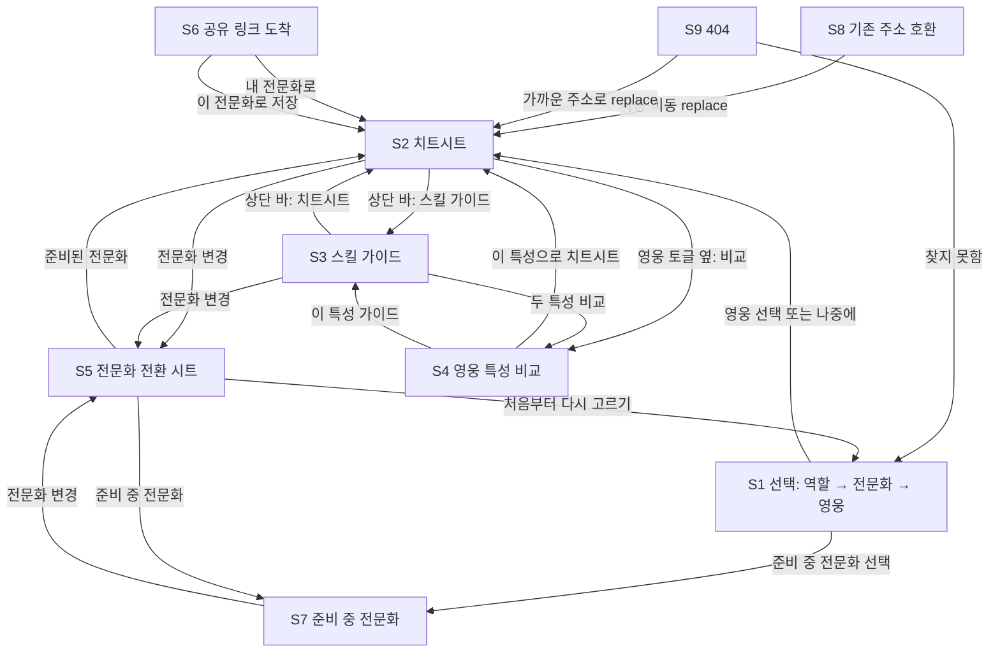
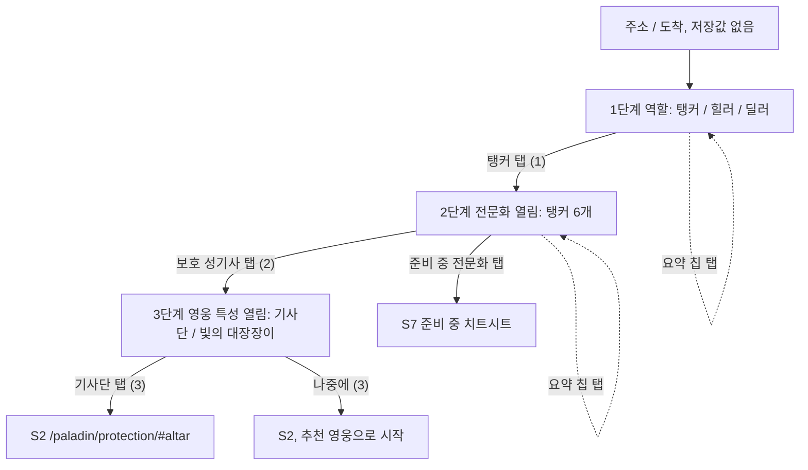
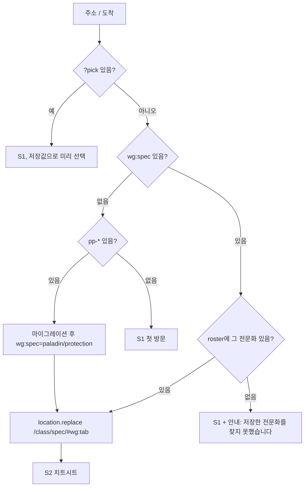
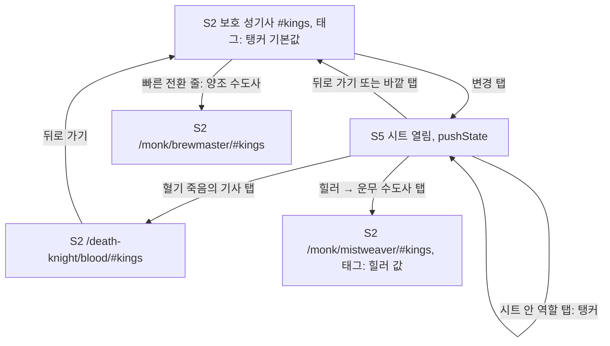
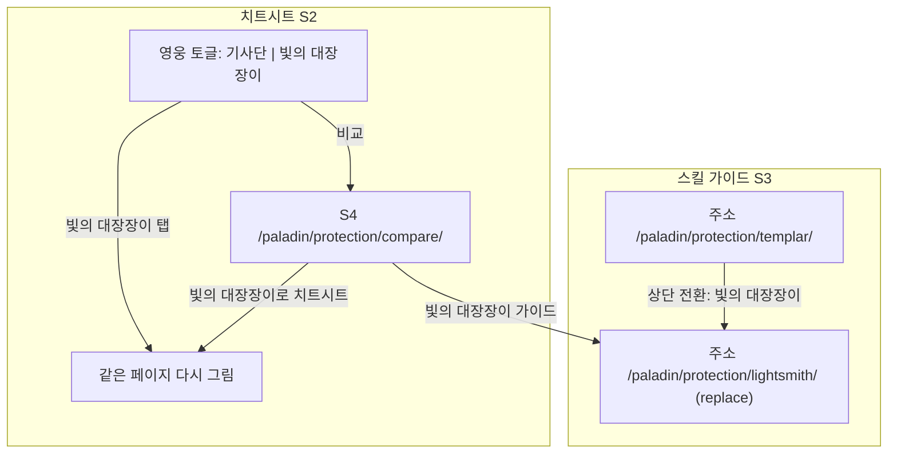
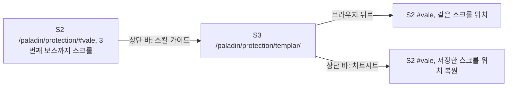
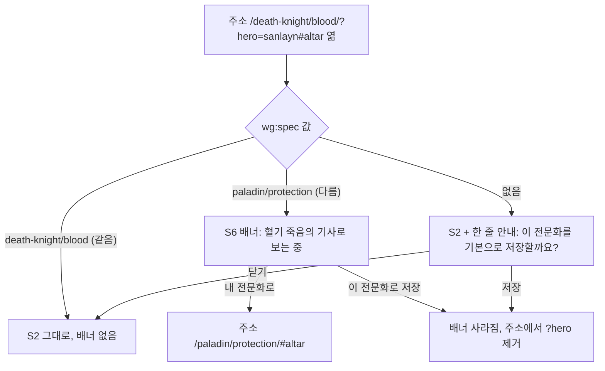
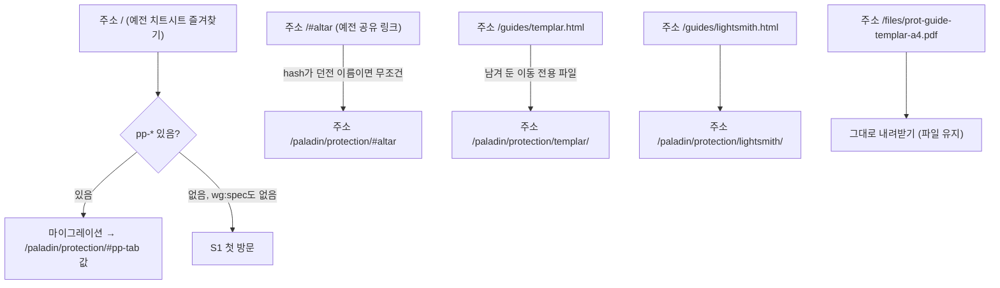
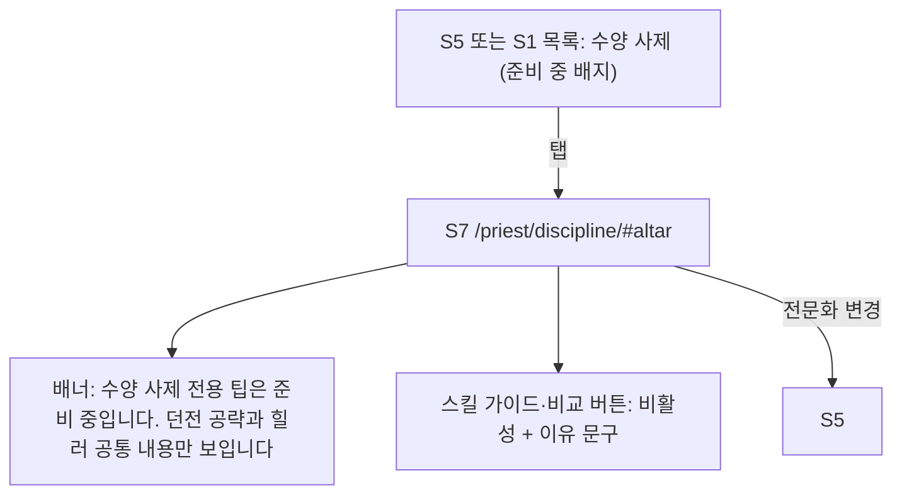
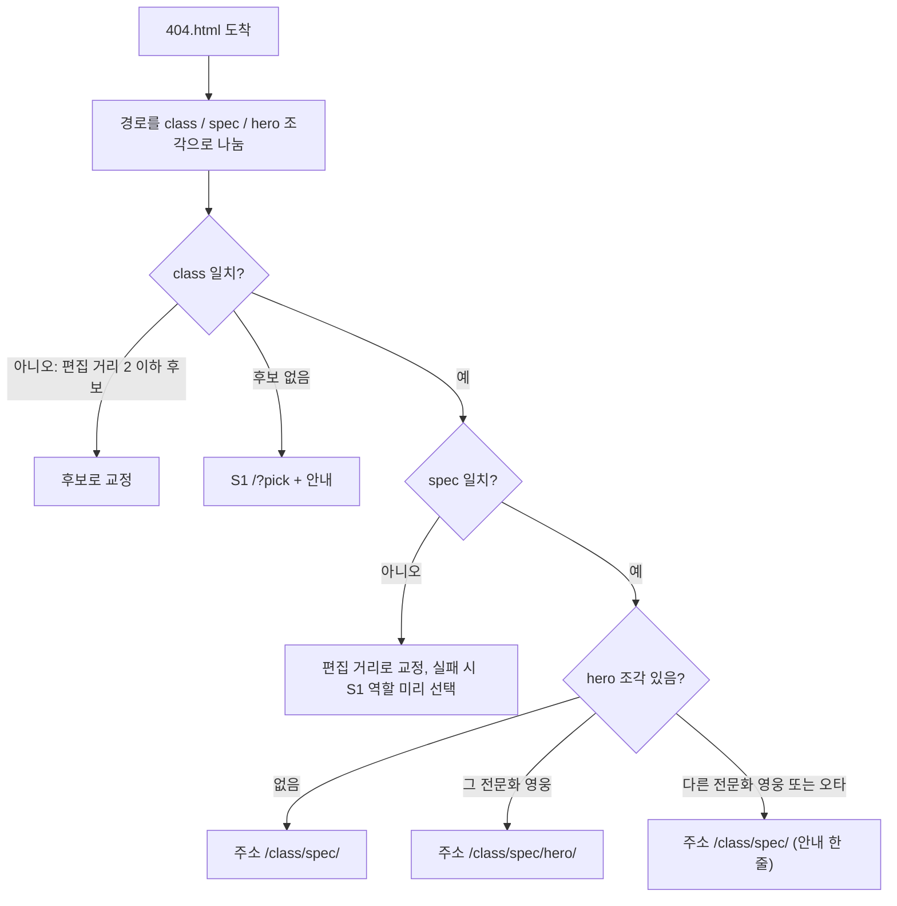

# UI 흐름 설계 (전 직업·전문화 확장)

작성: 2026-09-26 · 기준: `design/_decisions`(화면 ID S1~S9, URL, 저장 키) · 전문화 이름과 주소 조각(slug)은 `design/roster.json`(게임 빌드 12.1.0.69933)을 그대로 씁니다.

## 요약

- **첫 방문**: `/` 한 페이지에서 역할 → 전문화 → 영웅 특성을 위에서 아래로 고르면 치트시트로 갑니다. 휴대폰에서 3탭입니다.
- **재방문**: 저장된 전문화가 있으면 `/`를 거치지 않고 치트시트(`/paladin/protection/#altar`)로 바로 들어갑니다. 이때 `location.replace`를 써서 뒤로 가기가 선택 화면으로 돌아가지 않게 합니다.
- **전환**: 치트시트 상단 바 오른쪽의 "전문화 변경" 시트에서 바꿉니다. 보던 던전은 유지하고, 태그 필터는 역할이 같을 때만 유지합니다. 영웅 특성은 치트시트에서는 토글로, 스킬 가이드에서는 상단 전환으로 바꿉니다.
- **공유 링크**: 다른 사람 전문화의 링크를 열면 그 전문화로 보여 줍니다. 다만 내 저장값은 건드리지 않고, 배너에서 "이 전문화로 저장"을 눌렀을 때만 바꿉니다.
- **기존 주소**: 예전 보호 성기사 주소(`/`, `/#altar`, `/guides/templar.html`)는 모두 새 주소로 자동 이동합니다. 저장값 `pp-*`는 처음 한 번 `wg:*`로 옮겨 적습니다.

---

## 1. 전체 화면 지도

| ID | 화면 | 주소 형태 |
|---|---|---|
| S1 | 선택 (첫 방문) | `/` 또는 `/?pick` |
| S2 | 전문화 치트시트 | `/<class>/<spec>/#<dungeon>` |
| S3 | 스킬 가이드 | `/<class>/<spec>/<hero>/` |
| S4 | 영웅 특성 비교 | `/<class>/<spec>/compare/` |
| S5 | 전문화 전환 시트 (단독 페이지 `/specs/`) | S2·S3 위에 뜸 |
| S6 | 공유 링크 도착 (S2 + 배너) | `/<class>/<spec>/?hero=<hero>#<dungeon>` |
| S7 | 준비 중 전문화 (S2 변형) | `/<class>/<spec>/` |
| S8 | 기존 주소 호환 (순간 이동) | `/#altar`, `/guides/templar.html` |
| S9 | 404 안내 | 없는 주소 전부 |

---

## 2. 경로별 흐름

### a. 첫 방문: 역할 → 전문화 → 영웅 특성 → 치트시트

애플 iPhone 구매 페이지처럼 한 페이지에서 단계를 차례로 엽니다. 애플은 모델을 고르기 전에는 색상·용량 칸을 잠가 두는데(fieldset disabled, 2026-09-26 확인), 여기서도 앞 단계를 고르기 전에는 다음 단계를 흐리게 잠급니다. 고른 값은 상단 고정 요약 칩(예: `탱커 · 보호 성기사 · 기사단`)에 남고, 칩을 누르면 그 단계로 돌아가 다시 고를 수 있습니다.

| 단계 | 화면 | 사용자 행동 | 저장되는 상태 | URL | 뒤로 가기 동작 |
|---|---|---|---|---|---|
| 1 | S1 역할 | "탱커" 탭 (1탭째). 전문화 단계가 열리고 부드럽게 스크롤됩니다 | 없음 (sessionStorage `wg:pick`={role:"tank"}) | `/?pick&role=tank` (replaceState) | 사이트 이전 페이지로 나감 |
| 2 | S1 전문화 | "보호 성기사" 탭 (2탭째). 영웅 단계가 열립니다 | sessionStorage `wg:pick`에 spec 추가 | `/?pick&role=tank&spec=paladin/protection` (replaceState) | 사이트 이전 페이지로 나감 (단계마다 기록을 쌓지 않음) |
| 3 | S1 영웅 | "기사단" 탭 (3탭째) | `wg:spec`="paladin/protection", `wg:hero:paladin/protection`="templar", `wg:v`=1 | 현재 기록을 `/?pick&role=tank&spec=paladin/protection`로 replace한 뒤 S2로 push | — |
| 3' | S1 영웅 | "나중에" 탭 (3탭째). 전문화 데이터의 `defaultHero`로 시작합니다 | `wg:spec`만 저장, `wg:hero:*`는 저장하지 않음 | 위와 같음 | — |
| 4 | S2 | 치트시트 도착. 첫 던전은 Altar of Fangs | `wg:tab`="altar" | `/paladin/protection/#altar` | `/?pick&…`로 돌아가 S1이 고른 값 그대로 보입니다. `?pick`이 있어서 자동 이동하지 않습니다 |

- **탭 수**: 휴대폰 기준 기본 3탭(역할 1 + 전문화 1 + 영웅 또는 "나중에" 1)입니다.
- **최소 탭 수 정정**: `_decisions`에는 "나중에"로 최소 2탭이라고 적었지만, "나중에"도 탭 한 번이라 첫 방문 최소도 3탭입니다. 2탭으로 줄이려면 전문화를 누르는 순간 추천 영웅으로 바로 치트시트로 가고, 영웅 단계는 "영웅 특성 직접 고르기" 링크로만 여는 방식이 있습니다. 이건 결정이 필요한 선택지로 남깁니다(6절 끝).
- **S1을 다시 열었을 때**: 재방문 사용자가 `/?pick`으로 S1을 열면 저장된 역할·전문화가 미리 선택되어 있어서 0~1탭이면 끝납니다.

### b. 재방문

| 단계 | 화면 | 사용자 행동 | 저장되는 상태 | URL | 뒤로 가기 동작 |
|---|---|---|---|---|---|
| 1 | (순간) | 즐겨찾기나 주소창으로 `/`를 엶 | 읽기만 함: `wg:spec`, `wg:tab`, `wg:v` | `/` | — |
| 2 | S2 | 자동 이동. 마지막으로 본 던전이 열립니다 | 변화 없음 | `/paladin/protection/#kings` (`location.replace`) | `/`를 거치지 않고 사이트 이전 페이지로 나감 |

**건너뛰는 조건**: `wg:spec`이 있고, 그 값이 roster에 있고, URL에 `?pick`이 없을 때입니다.

**건너뛰지 않는 조건**
- 저장값(`wg:spec`, `pp-*`)이 하나도 없을 때 → S1 첫 방문.
- URL에 `?pick`이 있을 때 → 사용자가 일부러 다시 고르려는 경우입니다. 상단 바의 "처음부터 다시 고르기"가 이 주소로 갑니다.
- 저장된 전문화가 roster에서 사라졌을 때(예: 다음 확장팩에서 전문화 이름 변경) → S1을 열고 한 줄 안내를 띄웁니다.
- `wg:v`가 현재 버전보다 높을 때(다른 기기에서 새 버전 저장) → 무시하고 그대로 이동합니다. 버전 차이는 이동을 막지 않습니다.
- 주소가 `/`가 아니라 `/paladin/protection/`처럼 전문화 주소일 때 → S1을 거칠 일이 없습니다.

`wg:tab`이 없거나 그 던전이 이번 시즌 목록에 없으면 첫 던전(Altar of Fangs)을 엽니다.

### c. 전문화·역할 바꾸기

상단 바 오른쪽 "전문화 변경"(휴대폰은 "변경")을 누르면 아래에서 시트(S5)가 올라옵니다. 같은 역할 안에서 바꿀 때는 상단 바 아래 가로 아이콘 줄(애플 제품군 페이지의 모델 줄과 같은 형식)을 한 번만 누르면 됩니다.

| 단계 | 화면 | 사용자 행동 | 저장되는 상태 | URL | 뒤로 가기 동작 |
|---|---|---|---|---|---|
| 1 | S2 | "변경" 탭 | 없음 | 그대로 (`history.pushState({sheet:1})`) | 시트만 닫힘 |
| 2 | S5 | 시트가 현재 역할(탱커) 목록으로 열림. 현재 전문화에 체크 표시 | 없음 | 그대로 | 시트만 닫힘 |
| 3 | S5 | "혈기 죽음의 기사" 탭 | `wg:spec`="death-knight/blood" | 시트 기록을 `location.replace('/death-knight/blood/#kings')`로 교체 | 보호 성기사 `#kings`로 돌아감 (시트는 닫힌 상태) |
| 3' | S2 | 빠른 전환 줄에서 "양조 수도사" 탭 (시트 없이 1탭) | `wg:spec`="monk/brewmaster" | `/monk/brewmaster/#kings` (push) | 이전 전문화로 돌아감 |
| 4 | S2 | 새 전문화 치트시트. 던전 `#kings` 유지 | `wg:tab` 유지 | — | — |

**유지 규칙**
- **던전**: 주소의 `#hash`를 그대로 가져갑니다. 새 전문화에서 그 던전을 다루지 않으면 첫 던전을 엽니다.
- **태그 필터**: 역할별로 따로 저장합니다(`wg:tags:tank`, `wg:tags:healer`, `wg:tags:dps`). 탱커에서 탱커로 바꾸면 켜 둔 태그가 그대로 남습니다. 탱커에서 힐러로 바꾸면 `wg:tags:healer`를 쓰고, 없으면 힐러 기본값(광역 피해·해제·탱버·회피·차단·위치·참고)으로 시작합니다.
- **영웅 특성**: 전문화마다 따로 기억합니다(`wg:hero:death-knight/blood`). 처음 여는 전문화는 `defaultHero`로 시작합니다.
- **접기 상태**: `wg:open` 키가 보스 이름 기준이라 전문화가 바뀌어도 같은 보스는 같은 접힘 상태로 보입니다.

**빠른 전환 줄의 범위**: 탱커는 6개, 힐러는 7개를 한 줄에 둡니다. 딜러는 27개라 한 줄에 다 넣으면 가로 스크롤이 너무 깁니다. 그래서 같은 직업 딜러 전문화(예: 비전·화염·냉기 마법사)를 먼저 두고, 끝에 "딜러 전체"를 두어 S5를 엽니다.

### d. 영웅 특성 바꾸기

| 단계 | 화면 | 사용자 행동 | 저장되는 상태 | URL | 뒤로 가기 동작 |
|---|---|---|---|---|---|
| S2에서 | S2 | 영웅 토글 "빛의 대장장이" 탭. 영웅 카드와 영웅 전용 항목만 다시 그립니다 | `wg:hero:paladin/protection`="lightsmith" | 그대로 (공유 링크로 온 경우만 `?hero=` 값을 replaceState로 갱신) | 바꾸기 전 페이지가 아니라 이전 화면으로 (토글은 기록을 남기지 않음) |
| S3에서 | S3 | 상단 바 "기사단 \| 빛의 대장장이" 중 "빛의 대장장이" 탭 | `wg:hero:paladin/protection`="lightsmith" | `/paladin/protection/lightsmith/` (`location.replace`) | 가이드를 열기 전 화면(S2)으로 |
| S4에서 | S4 | 두 특성을 나란히 보고 "빛의 대장장이로 치트시트" 탭 | `wg:hero:paladin/protection`="lightsmith" | `/paladin/protection/#altar` (push) | S4로 돌아감 |
| S4에서 | S4 | "빛의 대장장이 가이드" 탭 | 같음 | `/paladin/protection/lightsmith/` (push) | S4로 돌아감 |

S3의 전환에 replace를 쓰는 이유: 두 가이드는 같은 자리의 다른 보기라서, 뒤로 가기를 누를 때마다 기사단과 빛의 대장장이를 왔다 갔다 하면 치트시트로 돌아가기 어렵습니다.

### e. 치트시트 ↔ 스킬 가이드 이동과 돌아오기

| 단계 | 화면 | 사용자 행동 | 저장되는 상태 | URL | 뒤로 가기 동작 |
|---|---|---|---|---|---|
| 1 | S2 | 상단 바 가운데 "치트시트 \| 스킬 가이드" 중 "스킬 가이드" 탭 | sessionStorage `wg:scroll:/paladin/protection/`={y:1840, hash:"vale"} | `/paladin/protection/templar/` (push). 현재 영웅(`wg:hero`)의 가이드로 감 | S2로 돌아감 |
| 2 | S3 | 가이드를 읽음 | 없음 | — | S2 `#vale`, 스크롤 복원 |
| 3 | S3 | 상단 바 "치트시트" 탭 | 없음 | `/paladin/protection/#vale` (push, hash는 `wg:tab`) | S3로 돌아감 |
| 4 | S2 | 도착 시 `wg:scroll:<path>`의 hash가 같으면 y 위치로 스크롤. 다르면 맨 위 | 읽은 뒤 지우지 않음(세션 동안 유지) | — | — |

브라우저 뒤로 가기는 보통 브라우저가 스크롤을 기억하지만, 휴대폰 사파리에서 페이지가 메모리에서 빠지면 맨 위로 돌아갑니다. `wg:scroll`은 그 경우를 위한 대비입니다.

**현재 코드와 다른 점**: 지금 `index.html`은 던전 탭을 눌러도 주소의 `#hash`를 바꾸지 않고 `pp-tab`에만 저장합니다(917행은 처음 열 때 hash를 읽기만 함). 새 설계에서는 탭을 누를 때마다 `history.replaceState`로 `#hash`를 바꿔서, 공유와 돌아오기에 던전이 실리게 합니다. replace를 쓰므로 뒤로 가기가 던전 탭마다 멈추지 않습니다.

### f. 공유 링크로 도착

예: 보호 성기사를 저장한 사용자가 친구에게서 `https://ggah1911.github.io/prot-paladin-s2/death-knight/blood/?hero=sanlayn#altar`를 받아 엽니다.

| 단계 | 화면 | 사용자 행동 | 저장되는 상태 | URL | 뒤로 가기 동작 |
|---|---|---|---|---|---|
| 1 | S6 | 링크를 엶. 혈기 죽음의 기사·산레인·Altar of Fangs로 보임. 상단에 배너 "혈기 죽음의 기사로 보는 중 · [내 전문화로] [이 전문화로 저장]" | 아무것도 쓰지 않음 (방문 모드). `wg:spec`, `wg:hero:*`, `wg:tab` 모두 그대로 | `/death-knight/blood/?hero=sanlayn#altar` | 메신저 등 링크를 연 곳으로 |
| 2a | S2 | "내 전문화로" 탭 | 없음 | `/paladin/protection/#altar` (push, 던전 유지) | 혈기 공유 페이지로 |
| 2b | S2 | "이 전문화로 저장" 탭 | `wg:spec`="death-knight/blood", `wg:hero:death-knight/blood`="sanlayn", `wg:tab`="altar" | `/death-knight/blood/#altar` (replaceState로 `?hero` 제거) | 링크를 연 곳으로 |
| 1' | S2 | 저장값이 없는 사람이 엶. 배너 대신 얇은 한 줄 "이 전문화를 기본으로 저장할까요? [저장] [닫기]" | "닫기"는 sessionStorage `wg:nudge-off`=1 | 같음 | 같음 |

**방문 모드에서 하는 것과 안 하는 것**
- 영웅 토글을 누르면 주소의 `?hero=`만 replaceState로 바꾸고, `wg:hero:*`에는 쓰지 않습니다.
- 던전 탭을 누르면 `#hash`만 바꾸고 `wg:tab`에는 쓰지 않습니다.
- 태그 필터는 그 역할의 저장값을 읽기만 합니다.
- **이유**: 친구 링크를 한 번 열어 봤다고 해서 다음 방문 때 혈기 죽음의 기사가 열리면 안 됩니다.

**공유 버튼**: 상단 바 오른쪽 메뉴의 "링크 복사"는 `/<class>/<spec>/?hero=<현재 영웅>#<현재 던전>`을 복사합니다. 영웅을 주소에 넣는 건 공유할 때뿐입니다.

### g. 기존 보호 성기사 주소·즐겨찾기

| 예전 주소 | 가는 곳 | 방법 | 뒤로 가기 |
|---|---|---|---|
| `/` (저장값 `pp-*` 있음) | `/paladin/protection/#<pp-tab 값>` | S1 스크립트가 마이그레이션 후 `location.replace` | 이전 사이트로 나감 |
| `/` (저장값 없음) | S1 | — | — |
| `/#altar` 등 던전 hash | `/paladin/protection/#altar` | S1 스크립트: hash가 던전 ID 8개 중 하나면 저장값과 상관없이 이동. 예전 링크는 전부 보호 성기사였기 때문 | 이전 사이트로 나감 |
| `/guides/templar.html` | `/paladin/protection/templar/` | 같은 경로에 남겨 둔 작은 HTML: `<meta http-equiv="refresh">` + `location.replace`(hash 유지) | 이전 사이트로 나감 |
| `/guides/lightsmith.html` | `/paladin/protection/lightsmith/` | 같음 | 같음 |
| `/files/prot-guide-*.pdf` | 파일 그대로 | 삭제하지 않음. 새 가이드는 인쇄용 CSS로 대신하고, 예전 PDF는 갱신하지 않는다는 문구만 가이드에 둠 | — |

**저장값 마이그레이션 (처음 한 번, `wg:v`가 없을 때)**

| 예전 키 | 예전 값 예시 | 새 키 | 새 값 |
|---|---|---|---|
| `pp-hero` | `templar` / `lightsmith` | `wg:hero:paladin/protection` | 같은 값 |
| `pp-tiplang` | `en` / `ko` | `wg:lang` | 같은 값 |
| `pp-tab` | `altar` 등 던전 ID | `wg:tab` | 같은 값 |
| `pp-open` | `{"deep-altar-Rav'i":true,…}` | `wg:open` | 같은 값 (키 형식 유지) |
| (`pp-*` 중 하나라도 있음) | — | `wg:spec` | `paladin/protection` |
| — | — | `wg:v` | `1` |

- **예전 키는 지우지 않습니다.** 새 버전에 문제가 생겨 예전 `index.html`로 되돌려도 예전 설정이 그대로 살아 있게 하기 위해서입니다.
- **태그 필터**: 지금 사이트는 태그 선택을 저장하지 않으므로 옮길 값이 없습니다. `wg:tags:tank`는 기본값(전부 켬)으로 시작합니다.

### h. 준비 안 된 전문화를 골랐을 때

| 단계 | 화면 | 사용자 행동 | 저장되는 상태 | URL | 뒤로 가기 동작 |
|---|---|---|---|---|---|
| 1 | S5 | 회색 "준비 중" 배지가 붙은 "수양 사제" 탭. 선택은 막지 않음 | `wg:spec`="priest/discipline" (사용자가 직접 골랐으므로 저장) | `/priest/discipline/#altar` | 이전 전문화 페이지로 |
| 2 | S7 | 치트시트가 공용 층(보스·일반몹·상세 공략의 개요·단계·파티 공통)과 힐러 역할 층만으로 보임 | 태그는 `wg:tags:healer` | — | — |
| 3 | S7 | "스킬 가이드" 버튼이 흐리게 보이고 아래에 "이 전문화 가이드는 아직 없습니다" | 없음 | — | — |

**S7에서 보이는 것과 빠지는 것**
- **보이는 것**:
  - 던전 탭, 보스 카드의 공용 항목, 상세 공략의 개요·단계·파티 공통
  - 역할 층("힐러 운영")
  - 영웅 특성 토글: 이름만 roster에서 가져와 표시
- **빠지는 것**:
  - "내 기술로 대응" 줄
  - 영웅 특성 카드
  - 매크로
  - 해제 담당표의 "담당" 칸: 전문화 키트가 없으면 계산하지 않고 "—"로 둠
  - 스킬 가이드·비교 링크
- **역할 층도 없는 경우**: 1단계에는 힐러·딜러 역할 층이 아직 없습니다. 이때는 공용 층만 보이고, 배너 문구를 "힐러 시점 내용도 준비 중입니다"로 바꿉니다.
- **주소**: 준비 중 전문화도 `/priest/discipline/` 폴더를 미리 만들어 둡니다. 그래서 404로 빠지지 않고, 나중에 콘텐츠가 채워져도 주소가 그대로입니다.

### i. 404 (오타·없는 경로)

GitHub Pages는 없는 경로에서 `404.html`을 보여 줍니다. 이 파일의 스크립트가 경로를 roster의 slug와 맞춰 보고, 가장 가까운 페이지로 `location.replace`합니다.

| 들어온 주소 | 가는 곳 | 이유 |
|---|---|---|
| `/paladin/protection/templer/` | `/paladin/protection/templar/` | 영웅 slug 편집 거리 1 |
| `/death-knight/blood/templar/` | `/death-knight/blood/` | 기사단은 혈기의 영웅 특성이 아님 |
| `/deathknight/blood/` | `/death-knight/blood/` | 하이픈 누락 교정 |
| `/demon-hunter/devourer/voidscarred/` | `/demon-hunter/devourer/void-scarred/` | 하이픈 누락 교정 |
| `/paladin/tank/` | `/?pick&role=tank` + "주소를 찾지 못했습니다" | spec 조각이 전문화가 아님 |
| `/abc/` | `/?pick` + 같은 안내 | 후보 없음 |

- 모든 이동은 `location.replace`라서, 잘못된 주소가 방문 기록에 남지 않습니다.
- `#hash`와 `?hero=`는 이동한 주소에 그대로 붙입니다.
- 교정은 slug 비교만 하고, 한글 주소(`/성기사/보호/`)는 받지 않습니다.

---

## 3. 전문화 선택기에서 40개를 보여 주는 방식

역할로 먼저 좁히면 한 번에 보는 수가 6개, 7개, 27개로 줄어듭니다. 탱커·힐러는 타일로, 딜러는 직업 묶음으로 보여 줍니다.

| 역할 | 개수 | 휴대폰 배치 | 줄 수 | 대략 높이 | 전문화까지 탭 |
|---|---|---|---|---|---|
| 탱커 | 6 | 2열 타일 (아이콘 + "보호 성기사") | 3줄 | 약 230px | 1 |
| 힐러 | 7 | 2열 타일 | 4줄 | 약 300px | 1 |
| 딜러 | 27 | **직업마다 한 줄**: 왼쪽 직업 이름(직업색 점), 오른쪽 전문화 칩 | 13줄 | 약 730px | 1 |

**딜러 배치를 이렇게 정한 이유**: 2열 타일로 27개를 놓으면 "파멸 악마사냥꾼"처럼 긴 이름이 두 줄로 꺾여 타일이 커집니다. 추정하면 14줄 × 약 64px, 즉 약 900px입니다. 직업 묶음으로 머리를 따로 달아 2열로 두면 약 1,300px(직업 머리 13 × 32px + 칩 17줄 × 52px)로 휴대폰 두 화면 가까이 됩니다. 반면 직업마다 한 줄로 두면 칩에는 전문화 이름("파멸")만 쓰면 되고, 13줄 × 56px ≈ 730px로 휴대폰 한 화면 조금 넘게 끝납니다. 가장 긴 줄은 사냥꾼·도적·마법사·흑마법사처럼 칩이 3개인 줄인데, 두 글자 칩 3개는 390px 폭에 한 줄로 들어갑니다.

**딜러 배치 예시 (roster 공식명, 직업 번호 순)**

| 직업 | 전문화 칩 |
|---|---|
| 전사 | 무기 · 분노 |
| 성기사 | 징벌 |
| 사냥꾼 | 야수 · 사격 · 생존 |
| 도적 | 암살 · 무법 · 잠행 |
| 사제 | 암흑 |
| 죽음의 기사 | 냉기 · 부정 |
| 주술사 | 정기 · 고양 |
| 마법사 | 비전 · 화염 · 냉기 |
| 흑마법사 | 고통 · 악마 · 파괴 |
| 수도사 | 풍운 |
| 드루이드 | 조화 · 야성 |
| 악마사냥꾼 | 파멸 · 포식 |
| 기원사 | 황폐 · 증강 |

합계 27개입니다. 탱커 6개는 방어 전사, 보호 성기사, 혈기 죽음의 기사, 양조 수도사, 수호 드루이드, 복수 악마사냥꾼이고, 힐러 7개는 신성 성기사, 수양 사제, 신성 사제, 복원 주술사, 운무 수도사, 회복 드루이드, 보존 기원사입니다.

**선택기 공통 규칙**
- 준비 중 전문화는 회색 "준비 중" 배지를 붙이되 누를 수 있습니다(h 경로).
- 현재 전문화에는 체크 표시를 하고, 직업색은 점과 테두리에만 씁니다.
- S5 시트는 현재 역할 탭이 열린 상태로 시작합니다. 시트 맨 위에 "탱커 | 힐러 | 딜러" 세그먼트가 있어서, 역할을 바꾸는 데 1탭, 전문화를 고르는 데 1탭이 듭니다.
- JavaScript 없이 여는 `/specs/` 페이지는 같은 배치를 링크 목록으로 보여 줍니다.

---

## 4. 모든 화면의 URL 예시

기준 주소: `https://ggah1911.github.io/prot-paladin-s2/`

| 화면 | 예시 1 | 예시 2 |
|---|---|---|
| S1 선택 | `https://ggah1911.github.io/prot-paladin-s2/` | `https://ggah1911.github.io/prot-paladin-s2/?pick&role=healer` |
| S2 치트시트 | `https://ggah1911.github.io/prot-paladin-s2/paladin/protection/#altar` | `https://ggah1911.github.io/prot-paladin-s2/death-knight/blood/#kings` |
| S3 스킬 가이드 | `https://ggah1911.github.io/prot-paladin-s2/paladin/protection/templar/` | `https://ggah1911.github.io/prot-paladin-s2/demon-hunter/vengeance/annihilator/` |
| S4 영웅 비교 | `https://ggah1911.github.io/prot-paladin-s2/paladin/protection/compare/` | `https://ggah1911.github.io/prot-paladin-s2/monk/brewmaster/compare/` |
| S5 전문화 전환 | (시트, S2 주소 그대로) `https://ggah1911.github.io/prot-paladin-s2/paladin/protection/#vale` | (단독) `https://ggah1911.github.io/prot-paladin-s2/specs/` |
| S6 공유 도착 | `https://ggah1911.github.io/prot-paladin-s2/death-knight/blood/?hero=sanlayn#altar` | `https://ggah1911.github.io/prot-paladin-s2/paladin/protection/?hero=lightsmith#temple` |
| S7 준비 중 | `https://ggah1911.github.io/prot-paladin-s2/priest/discipline/#altar` | `https://ggah1911.github.io/prot-paladin-s2/demon-hunter/devourer/#ruby` |
| S8 기존 주소 | `https://ggah1911.github.io/prot-paladin-s2/#altar` → `…/paladin/protection/#altar` | `https://ggah1911.github.io/prot-paladin-s2/guides/templar.html` → `…/paladin/protection/templar/` |
| S9 404 | `https://ggah1911.github.io/prot-paladin-s2/paladin/protection/templer/` → `…/paladin/protection/templar/` | `https://ggah1911.github.io/prot-paladin-s2/death-knight/blood/templar/` → `…/death-knight/blood/` |

던전 ID는 지금 사이트와 같은 8개(`altar`, `vale`, `nalorakk`, `murder`, `voidscar`, `kings`, `ruby`, `temple`)를 그대로 씁니다.

---

## 5. 뒤로 가기 규칙 요약

**push(기록을 쌓음)는 사용자가 "다른 곳으로 간다"고 느끼는 이동에만 씁니다.**

| 이동 | 방식 | 이유 |
|---|---|---|
| S1 → S2 (영웅 선택 후) | 현재 기록을 `/?pick&…`로 replace한 뒤 S2를 push | 뒤로 가면 고른 값이 남은 S1이 보이고, `?pick` 덕분에 다시 자동 이동하지 않음 |
| `/` → S2 (재방문 자동 이동) | replace | 뒤로 가기가 `/`에 걸려 다시 튕기는 고리를 막음 |
| S8 기존 주소, S9 404 | replace | 거쳐 가는 주소를 기록에 남기지 않음 |
| S1 안에서 단계 진행 | replaceState (`?role=`, `&spec=`) | 새로고침해도 고른 단계가 남되, 뒤로 가기가 단계마다 멈추지 않음 |
| S2 던전 탭 | replaceState (`#hash`) | 공유·돌아오기에 던전이 실리되, 탭마다 기록이 쌓이지 않음 |
| S2 영웅 토글 | 이동 없음 (공유 모드만 `?hero` replaceState) | 같은 페이지의 보기 전환 |
| S2 ↔ S3, S2/S3 → S4, S4 → S2/S3 | push | 다른 페이지로 가는 이동 |
| S3 영웅 전환 | replace | 같은 자리의 다른 보기. 뒤로 가기가 치트시트로 바로 가게 함 |
| S5 시트 열기 | pushState (주소 그대로, state만 추가) | 휴대폰 뒤로 가기로 시트를 닫게 함 |
| S5에서 전문화 선택 | 시트 기록을 replace | 뒤로 가기 한 번이면 이전 전문화로 돌아감(시트를 거치지 않음) |
| 빠른 전환 줄 | push | 전문화가 바뀌는 이동 |
| S6 "내 전문화로" | push | 공유 페이지로 돌아갈 수 있게 |
| S6 "이 전문화로 저장" | replaceState (`?hero` 제거) | 같은 페이지 유지 |

---

## 6. 이 문서에서 새로 정한 것 (결정 확인 필요)

`_decisions`에 없던 내용을 이 문서에서 정했습니다. 확인이 필요한 곳은 아래와 같습니다.

1. **첫 방문 최소 탭 수 정정**: "나중에"도 탭 한 번이므로 최소 3탭입니다. 2탭으로 줄이려면 전문화를 누르는 순간 추천 영웅으로 바로 이동하고, 영웅 단계는 링크로만 여는 방식이 필요합니다.
   - 추천: 3탭 유지. 영웅 특성을 처음에 한 번 보여 주는 게 치트시트 내용(영웅 카드)을 이해하는 데 도움이 됩니다.
2. **추천 영웅(`defaultHero`)의 출처**: 전문화 데이터에 `defaultHero`를 두고, 값은 Wowhead 특성 빌드 페이지에서 쐐기에 ★가 붙은 영웅으로 정합니다.
   - 보호 성기사의 경우 이 기준이면 빛의 대장장이가 됩니다. 지금 사이트의 기본값은 기사단이므로, 기존 사용자는 `pp-hero`를 옮겨 적어서 영향이 없습니다.
   - 새 사용자에게 기사단을 계속 기본으로 보여 줄지는 결정이 필요합니다.
3. **S1 단계 상태를 주소에 남김**: `?pick&role=…&spec=…`를 replaceState로 남겨서 새로고침과 뒤로 가기에 대응합니다(sessionStorage `wg:pick`은 보조).
4. **S5 시트 열기에 pushState, 선택에 replace**를 씁니다(5절 표).
5. **던전 탭 클릭 때 `#hash` 갱신**: 지금 코드에는 없는 동작입니다. replaceState로 추가합니다.
6. **S3 영웅 전환은 replace**를 씁니다.
7. **공유 링크 방문 모드에서는 `wg:*`를 하나도 쓰지 않습니다.** `wg:tab`도 쓰지 않습니다.
8. **저장값이 없는 사람이 공유 링크를 열면 한 줄 저장 제안**을 띄우고, 닫으면 sessionStorage `wg:nudge-off`로 그 세션 동안 숨깁니다.
9. **딜러 선택기는 직업마다 한 줄 배치**로 합니다(2열 타일 대비 높이 약 절반).
10. **예전 PDF는 삭제하지 않고 갱신도 하지 않습니다.**
11. **404 교정은 편집 거리 2 이하**, 한글 주소는 받지 않습니다.
